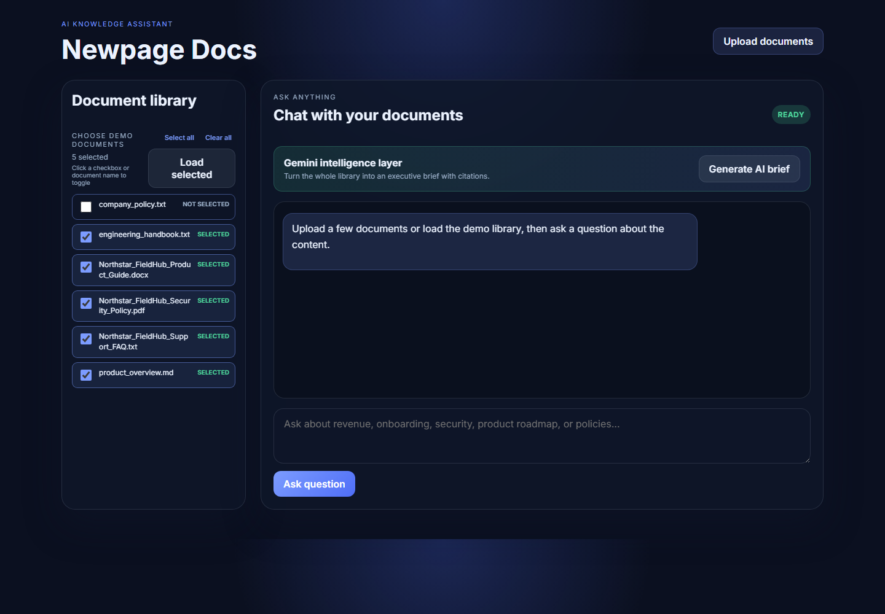
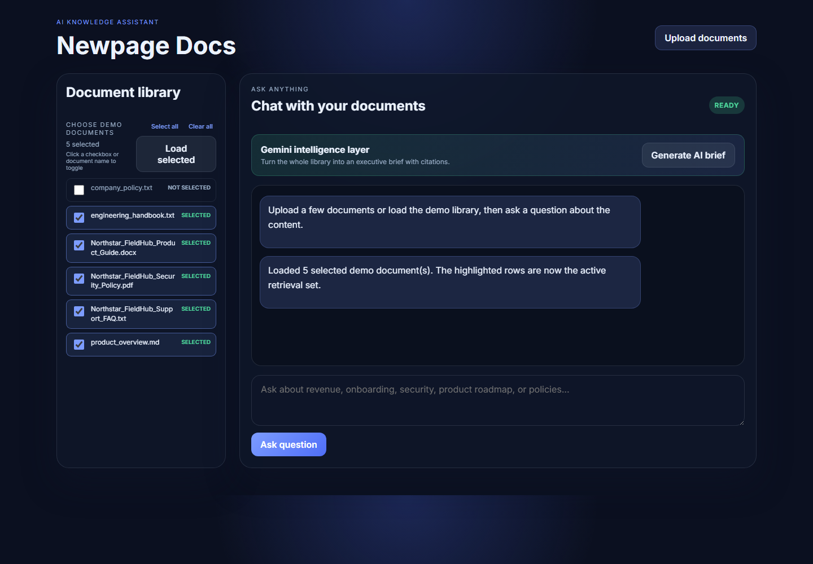
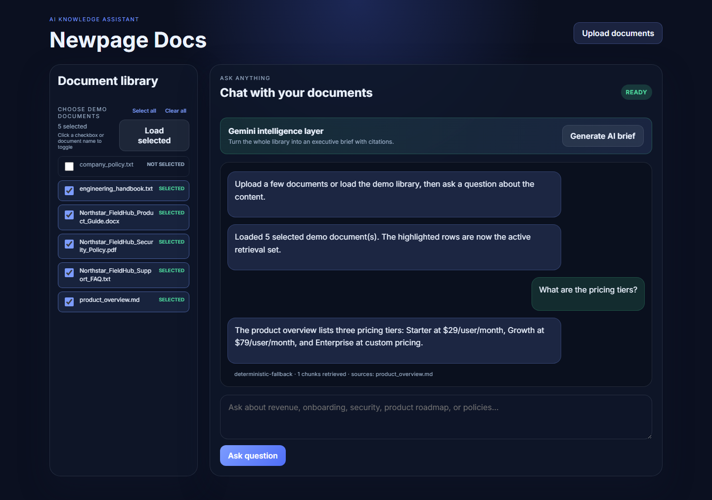
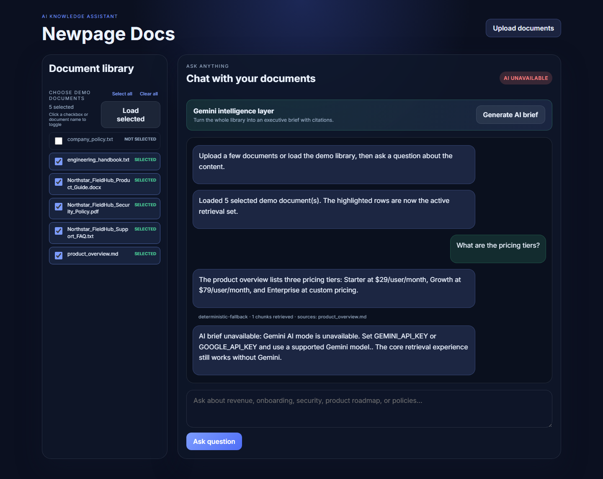

# Newpage Docs Q&A

## User Guide

Newpage Docs is a document question-and-answer application. It lets you upload a document collection, retrieve relevant passages, and ask questions about the content.

The app supports two modes:

- **Local mode:** works without an API key using local retrieval and deterministic fallback responses.
- **AI mode:** uses LangChain and Gemini to generate natural-language answers from retrieved document context.

The application always retrieves relevant document chunks before generating an answer. In AI mode, Gemini receives only the retrieved context, not the entire unrestricted application state.

## What You Can Do

- Choose which included demo documents to load.
- Upload text, Markdown, PDF, or DOCX files.
- Ask questions about the document collection.
- See which documents were used to support an answer.
- Inspect the retrieval trace, including provider, retrieved chunk count, score, and grounded status.
- Generate an AI executive brief when Gemini mode is configured.

## Requirements

- Python 3.12 or later
- A browser such as Chrome, Edge, or Firefox
- Gemini API key only for AI mode

## Installation

From the repository root:

```powershell
py -3.12 -m pip install -r requirements.txt
```

Start the application:

```powershell
py -3.12 -m uvicorn app.main:app --reload
```

Open the application in a browser:

```text
http://localhost:8000
```

## Local Mode Without AI

Local mode requires no Gemini key and does not make external model calls.

1. Make sure both API key values are blank or absent in `.env`:

   ```env
   GOOGLE_API_KEY=
   GEMINI_API_KEY=
   ```

2. Start the application.
3. Use the **Choose demo documents** picker. Clear any files you do not want, or use **Select all** / **Clear all**.
4. Click **Load selected**.
5. The selected files remain highlighted in the single document list as the active retrieval set.
6. Ask a question about pricing, security, roadmap, engineering, or support.

The local mode still demonstrates real RAG fundamentals:

```text
Question
  -> document chunking
  -> local token-based retrieval
  -> ranked relevant passages
  -> deterministic grounded response
```

This mode is useful for reviewers who want to run the project without an external account or API key.

## AI Mode With Gemini

AI mode requires your own Gemini API key. The repository does not contain a key.

1. Copy the example environment file:

   ```powershell
   Copy-Item .env.example .env
   ```

2. Open `.env` and provide your own key:

   ```env
   GOOGLE_API_KEY=
   GEMINI_API_KEY=your-own-gemini-api-key
   GEMINI_MODEL=gemini-flash-latest
   ```

   Google supports both `GOOGLE_API_KEY` and `GEMINI_API_KEY`. If both are set, `GOOGLE_API_KEY` takes precedence.

3. Start or restart the application:

   ```powershell
   py -3.12 -m uvicorn app.main:app --reload
   ```

4. Choose the demo documents to use, click **Load selected**, and ask a question.

The AI flow is:

```text
Question
  -> local document retrieval
  -> ranked context with source names and scores
  -> LangChain prompt chain
  -> Gemini LLM
  -> grounded answer with citations
```

The UI reports `langchain-gemini` when Gemini generation succeeds. If no key is configured, it reports `deterministic-fallback`.

### Security

- Never paste an API key into frontend code.
- Never commit `.env` to Git.
- Never share an API key in email, chat, screenshots, or issue reports.
- Use a restricted Gemini key where possible.
- Use a secret manager for a production deployment.
- If a key is exposed, revoke it and create a replacement immediately.

## Loading Documents

### Included demo documents

The repository includes examples in `sample_docs/`:

- Company policy text
- Engineering handbook text
- Product overview Markdown
- Northstar FieldHub product guide DOCX
- Northstar FieldHub security policy PDF
- Northstar FieldHub support FAQ text

Select or clear the checkboxes in the single **Choose demo documents** list, or click a document name to toggle it. Selected rows are highlighted. Click **Load selected** to load only those highlighted files into the retrieval index. The same highlighted list remains visible as the active document set, so documents are not duplicated in a second list.

### Uploading your own documents

1. Click **Upload documents**.
2. Select one or more supported files.
3. Wait for the upload confirmation in the chat.
4. Ask a question about the uploaded content.

Supported formats:

- `.txt`
- `.md`
- `.pdf`
- `.docx`

Uploaded files start a fresh session document set. The previously selected demo documents are removed from the active retrieval index, so questions after an upload use only the uploaded files. To return to demo content, select the desired demo rows and click **Load selected** again.

Uploaded files are parsed, normalized, split into overlapping chunks, and stored in the in-memory retrieval index. The current demo does not persist uploads after the server restarts.

## Asking Questions

Good questions are specific and connected to the document content. Examples:

- `What are the pricing tiers?`
- `What is the customer data policy for public AI tools?`
- `What is the on-call incident response expectation?`
- `What is on the product roadmap?`
- `What are the security commitments?`
- `What support escalation process is documented?`

The answer includes a source trace showing the documents and chunks that influenced the response. In AI mode, Gemini is instructed to use only that retrieved context.

## Gemini Executive Brief

The **Generate AI brief** button is available as the main Gemini showcase feature.

It asks Gemini to synthesize the document collection into:

- Executive summary
- Key facts
- Risks or gaps
- Suggested questions
- Source citations

This feature is intentionally AI-only because it demonstrates synthesis across the collection rather than a fixed deterministic answer. If Gemini is unavailable, the app displays an explicit explanation while keeping normal document retrieval available.

## Screenshots

These screenshots were captured from a real browser test run on `2026-08-15_16-42-47`. The run completed with 9 passing tests.

### Application shell

The initial screen provides the document library, upload action, chat workspace, and AI brief action.


### Demo document selection

The picker shows the available demo documents with visible checkboxes. Clear a document to exclude it before loading.



### Selected document library

After clicking **Load selected**, the checked documents remain highlighted in the single active document list. There is no duplicate Loaded docs list.



### Grounded answer and RAG trace

The answer view shows the response, supporting source, provider, and retrieval metadata.



### Gemini executive brief

The Gemini showcase produces a structured executive brief from the document collection.



## Health and Diagnostics

The service exposes a health endpoint:

```text
http://localhost:8000/api/health
```

Example response:

```json
{
  "status": "ok",
  "documents": 3,
  "chunks": 9,
  "ai_provider": "langchain-gemini",
  "model": "gemini-flash-latest"
}
```

Useful values:

- `langchain-gemini`: Gemini was configured and initialized.
- `deterministic-fallback`: no usable API key was configured.
- `model: null`: the application is operating without Gemini.

A configured provider does not guarantee that a request will succeed. Model availability, quota, region, account access, and key restrictions can affect the live request. The app falls back for normal questions and reports AI-brief failures explicitly.

Gemini free-tier projects have request quotas. If the quota is exceeded, the AI brief reports that the quota must reset or that another permitted Gemini project/key should be configured. This does not prevent local retrieval and deterministic fallback questions from working.

## Running Tests

Backend and browser tests:

```powershell
py -3.12 -m pytest -q
```

The browser tests require the FastAPI server to be running on port 8000.

Expected result for the current suite:

```text
9 passed
```

To capture a new timestamped evidence run:

```powershell
py -3.12 tests/capture_evidence.py
```

Evidence is written to:

```text
tests/test-runs/YYYY-MM-DD_HH-MM-SS/
```

The folder contains screenshots and a `USER_TEST_GUIDE.md` describing the test protocol and result.

## Current Limitations

- Uploaded files are held in memory and are not persisted.
- Retrieval is lexical rather than embedding-based semantic search.
- The demo has no authentication or multi-user isolation.
- The current evidence tests assume a local server on port 8000.
- Gemini availability depends on the user’s own account, model access, quota, and API key configuration.

These are deliberate assessment trade-offs documented in the main [README](README.md), with a productionization roadmap for storage, embeddings, access control, evaluation, and deployment.
